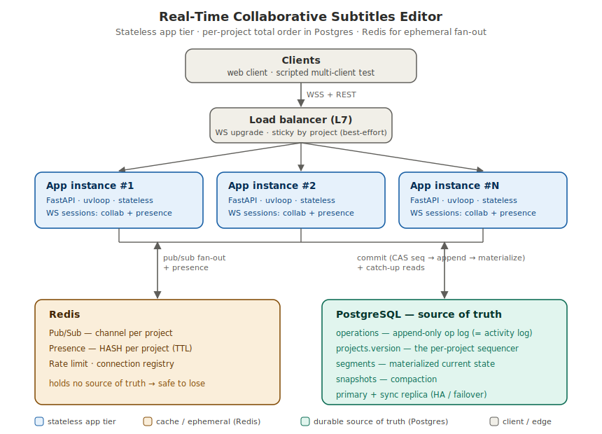

# 🎬 Sonata — Real-Time Collaborative Subtitles Editor

> A backend (and web client) for **real-time, multi-user editing of a dubbing-studio
> subtitle timeline** — several editors edit the same project at once and every change
> converges to one identical state, no matter which server instance they hit.

A project document is an ordered list of **segments**, each `{ chunk_id, start_time,
end_time, speaker_id, text }`. Multiple editors create / edit / delete / reorder segments
live; the document is durable across restarts; reconnects never lose or duplicate edits.

Built to the scale targets in [`DESIGN.md`](./DESIGN.md): 2–20 concurrent editors per
project, thousands of active projects, running on **multiple stateless instances behind a
load balancer**, with edit echo **< 150 ms**.

---

## Table of contents

- [Overview](#overview)
- [Demo](#demo)
- [Features](#features)
- [Architecture](#architecture)
- [How convergence works](#how-convergence-works)
- [Tech stack](#tech-stack)
- [Quick start](#quick-start)
- [Web client](#web-client)
- [Testing and simulations](#testing-and-simulations)
- [API reference](#api-reference)
- [Project structure](#project-structure)
- [Design document](#design-document)

---

## Overview

A dubbing studio needs several people editing one transcript/subtitle timeline
simultaneously — fixing timecodes, reassigning speakers, rewriting lines — and seeing each
other's changes instantly. The hard part isn't the editor; it's making concurrent edits
**converge** across many server instances, survive crashes, and recover cleanly from
dropped connections.

This project solves that with a deliberately simple, defensible design:

- **One source of truth per project.** Every edit becomes an immutable operation appended
  to a per-project, totally-ordered log in PostgreSQL. Order ⇒ convergence, provably.
- **A stateless app tier.** Any FastAPI instance can serve any client; Redis Pub/Sub fans
  edits out across instances so two editors on *different* servers stay in sync.
- **Ephemeral presence + durable history.** Cursors live in Redis (throwaway); the op log
  doubles as the activity log and the basis for undo.

The trade-offs, alternatives, back-of-the-envelope math, data model, ADRs, scaling notes,
and failure modes are all in [`DESIGN.md`](./DESIGN.md).

---

## Demo

Each clip is a **single side-by-side recording of two users on two different backend
instances** — **left = User A on `app1`** (teal bar), **right = User B on `app2`** (indigo
bar), recorded by the Playwright suite (slow-paced for clarity) and merged with `ffmpeg`.

Each link opens the clip on its own GitHub page with a video player (GitHub doesn't embed
repo-hosted videos inline inside a README).

▶ **[Two users editing the same field — live peer cursors, then convergence](https://github.com/shikharx06/live_subtitle_editor/blob/main/docs/media/playwright/2b-two-users-in-the-same-field-live-peer-cursors-render-then-converge.mp4)**

| # | Scenario | What it proves | Watch |
|---|----------|----------------|-------|
| 1 | Create + type | a line created and typed on app1 appears on app2 | [▶ play](https://github.com/shikharx06/live_subtitle_editor/blob/main/docs/media/playwright/1-create-type-text-converges-a-app1-b-app2.mp4) |
| 2 | Same-text LWW | concurrent edits to the same text converge to one value | [▶ play](https://github.com/shikharx06/live_subtitle_editor/blob/main/docs/media/playwright/2-concurrent-edits-to-same-text-converge-to-one-value-lww.mp4) |
| 2b | Same field + live cursors | both users in one field see each other's cursor, then converge | [▶ play](https://github.com/shikharx06/live_subtitle_editor/blob/main/docs/media/playwright/2b-two-users-in-the-same-field-live-peer-cursors-render-then-converge.mp4) |
| 3 | Different fields | concurrent edits to different fields both survive | [▶ play](https://github.com/shikharx06/live_subtitle_editor/blob/main/docs/media/playwright/3-concurrent-edits-to-different-fields-both-survive.mp4) |
| 4 | Reorder | reordering rows converges to one identical order | [▶ play](https://github.com/shikharx06/live_subtitle_editor/blob/main/docs/media/playwright/4-add-3-reorder-converges-row-order.mp4) |
| 5 | Delete | deleting a line removes it for the peer | [▶ play](https://github.com/shikharx06/live_subtitle_editor/blob/main/docs/media/playwright/5-delete-removes-segment-for-the-peer.mp4) |
| 6 | Undo | undo reverts an edit visibly to the peer | [▶ play](https://github.com/shikharx06/live_subtitle_editor/blob/main/docs/media/playwright/6-undo-reverts-an-edit-visibly-to-the-peer.mp4) |
| 7 | Presence | a presence avatar appears when a peer focuses a field | [▶ play](https://github.com/shikharx06/live_subtitle_editor/blob/main/docs/media/playwright/7-presence-chip-appears-for-a-focused-peer.mp4) |
| 8 | Reconnect / reload | reloading a peer resyncs it to the converged state | [▶ play](https://github.com/shikharx06/live_subtitle_editor/blob/main/docs/media/playwright/8-reload-b-resyncs-to-converged-state.mp4) |
| 9 | Randomized stress | 30 mixed ops from both users converge and match the backend DB | [▶ play](https://github.com/shikharx06/live_subtitle_editor/blob/main/docs/media/playwright/9-randomized-stress-simulation-converges-and-matches-backend.mp4) |

All `.mp4` files are in [`docs/media/playwright/`](docs/media/playwright/).

---

## Features

- **Live multi-user editing** — create, edit, delete, and **reorder** segments; every
  connected client sees each change in real time.
- **Cross-instance convergence** — editors on *different* server instances always end in
  the same final state (no "it depends which server you hit").
- **Presence + live cursors** — see who's online and a colored tag on the exact field a
  peer is editing.
- **Persistence** — the document survives server restarts; a reconnecting client gets the
  current state, then live updates.
- **Undo + activity log** — per-user undo and an auditable "who changed what, when".
- **Reconnect-safe** — dropped connections lose no edits and create no duplicates
  (idempotent, resumable).
- **Horizontally scalable** — stateless app tier behind a load balancer.

---

## Architecture



- **Clients** connect over **WebSocket** through an **L7 load balancer**.
- A tier of **stateless FastAPI** instances handle connections; the load balancer can route
  any client to any instance.
- Each edit is committed to **PostgreSQL** — the single source of truth — which assigns a
  per-project **monotonic sequence** (the ordering that guarantees convergence), appends to
  an event-sourced **operation log**, and updates a materialized **segments** table.
- **Redis Pub/Sub** fans the committed op out to every instance, which relays it to its
  local WebSocket sessions. **Redis** also holds **ephemeral presence** (TTL hash).

Losing Redis degrades only liveness (clients re-sync from the durable op log); Postgres is
never bypassed, so the system degrades to read-only rather than diverging. Full reasoning,
including 10×/100× scaling bottlenecks and failure modes, is in [`DESIGN.md`](./DESIGN.md).

---

## How convergence works

| Concern | Mechanism |
|---|---|
| **Total order** | A per-project sequence assigned by an atomic `UPDATE projects SET version = version + 1 RETURNING version` (compare-and-swap). The op log `(project_id, seq)` is the canonical history. |
| **Same-segment edits** | Field-level **last-writer-wins** by `seq` — concurrent edits to different fields both survive; same-field edits resolve to the highest seq. |
| **Reordering** | **Fractional indexing** (LexoRank-style position keys) so concurrent inserts/moves don't collide; ties break on `chunk_id`. |
| **Reconnect** | Client-generated `client_op_id` (idempotency key) + `last_seq` resume ⇒ at-least-once delivery + idempotent apply = effectively exactly-once state. |

Because every replica applies the same totally-ordered op stream, they all reach the same
state — no CRDT/OT machinery required at this scale. See [`DESIGN.md` §5](./DESIGN.md) for
the data model, the exact commit transaction, and the ADRs behind these choices.

---

## Tech stack

| Layer | Choice |
|---|---|
| Language / runtime | Python 3.12, asyncio + uvloop |
| API / WebSocket | FastAPI + uvicorn |
| Source of truth | PostgreSQL (event-sourced op log + materialized state) |
| Fan-out / presence | Redis (Pub/Sub + TTL hashes) |
| Load balancer | nginx (L7, WebSocket upgrade) |
| Web client | Next.js (App Router) + TypeScript + Tailwind |
| E2E tests | Playwright (two-user, cross-instance) |
| Packaging | Docker Compose |

---

## Quick start

Boot the whole backend (Postgres, Redis, two app instances, nginx) with one command:

```bash
docker compose up -d --build      # boots postgres, redis, app1, app2, nginx
docker compose ps                 # wait until app1/app2 are healthy
```

Schema is bootstrapped idempotently on startup — no migration step. Tear down with
`docker compose down -v`.

| Endpoint | Serves |
|---|---|
| `http://localhost:8080` | nginx load balancer (REST + WS) |
| `http://localhost:8001` / `:8002` | app1 / app2 directly (used to demo two instances) |

> The backend instances only serve the **API** (opening one in a browser shows a small
> notice). The editor UI is the Next.js app below.

---

## Web client

A **Next.js + TypeScript + Tailwind** editor lives in [`web/`](web/):

```bash
cd web
npm install
npx playwright install chromium   # for the simulations (one-time)
npm run dev                        # http://localhost:3000  (or 3100 if 3000 is taken)
```

**See cross-instance convergence live:** create a project, then click **“Open on app2 ↗”**
in the header to open the *same project* on the other instance in a second tab. Each tab is
a different user (avatar in the header) on a **different backend instance** — edits echo
live and converge, with presence and per-field peer cursors. Pick the instance per tab via
`?instance=app1|app2|lb`. Details + a full simulation gallery: [`web/README.md`](web/README.md).

---

## Testing and simulations

**Backend convergence tests** (Python, need the stack running):

```bash
uv venv .venv && uv pip install -r requirements.txt pytest pytest-asyncio websockets
.venv/bin/python -m pytest tests/ -v
```

| Test | Property proven |
|---|---|
| `test_cross_instance_convergence` | concurrent same-segment edits from app1 + app2 → identical final state on both clients and in Postgres |
| `test_concurrent_inserts_order_converges` | concurrent creates from both instances → one identical ordering everywhere |
| `test_reconnect_replay_is_idempotent` | replaying an unacked op with the same `client_op_id` → no duplicate, no extra seq, no loss |
| `test_resume_delta_after_disconnect` | reconnect with `last_seq` → only missed ops replayed, client converges |
| `test_via_load_balancer` | two clients through nginx converge |
| `tests/test_fracindex.py` | fractional-index ordering invariants (standalone, no stack) |

**Playwright simulations** (two users, two instances — the [Demo](#demo) videos):

```bash
cd web
npx playwright test                        # 10 two-user cross-instance simulations
PW_SLOWMO=700 npx playwright test --headed # watch them; PW_VIDEO=1 records side-by-side clips
```

---

## API reference

### Create a project

```bash
curl -s -X POST http://localhost:8080/projects \
  -H 'content-type: application/json' -d '{"title":"My dub"}'
# {"id":"<project_id>","title":"My dub","current_seq":0,"snapshot_seq":0,"created_at":"..."}
```

### Read the ordered snapshot

```bash
curl -s http://localhost:8080/projects/<project_id>
# {"id":"...","current_seq":N,"snapshot_seq":0,"segments":[ ...ordered by position... ]}
```

### WebSocket protocol

Connect to `ws://localhost:8080/projects/<project_id>/ws` (or `:8001`/`:8002` to pin an
instance). The first message must be `hello`:

```json
{ "type": "hello", "user_id": "<uuid>", "last_seq": null }
```

The server replies `welcome` (snapshot + `current_seq`), then live `op`s. Client → server
messages and the matching broadcast:

```json
{ "type": "op", "client_op_id": "<uuid>", "op_type": "create",
  "fields": { "text": "hello world", "start_time_ms": 0, "end_time_ms": 1500 } }

{ "type": "op", "client_op_id": "<uuid>", "op_type": "update", "chunk_id": "<id>", "fields": { "text": "edited" } }
{ "type": "op", "client_op_id": "<uuid>", "op_type": "move",   "chunk_id": "<id>", "before": "a", "after": "b" }
{ "type": "op", "client_op_id": "<uuid>", "op_type": "delete", "chunk_id": "<id>" }
{ "type": "presence", "cursor": { "chunk_id": "<id>", "field": "text" } }
{ "type": "undo", "client_op_id": "<uuid>" }
```

**Reconnect:** send `hello` with the highest contiguous `seq` you applied; the server sends
a `sync` of only the ops you missed (or a full snapshot if you've fallen behind a snapshot),
then replays any unacked ops idempotently.

---

## Project structure

```
app/                     FastAPI backend (layered: composition root → api → services → domain/persistence/realtime)
  main.py                lifespan composition root; mounts routers; serves the API notice at /
  domain/                models, fractional ordering, OperationFactory (forward + inverse ops)
  persistence/           asyncpg pool, idempotent schema, Project/Segment/Operation repositories
  services/              CollaborationService — the commit/sequencer (CAS + idempotent append + LWW), undo, snapshot
  realtime/              RedisPubSub fan-out, presence store, WS ConnectionManager
  api/                   REST router + WebSocket endpoint (EditorConnection dispatch)
tests/                   backend convergence + fracindex tests, WS protocol test client
web/                     Next.js + Tailwind client + Playwright two-user simulations
docs/                    architecture.svg + recorded simulation videos
docker-compose.yml       postgres, redis, app1, app2, nginx
Dockerfile               app image (python 3.12-slim, uvicorn[uvloop])
nginx.conf               L7 load balancer with WebSocket upgrade
DESIGN.md                the design doc (requirements, BOTE, LLD, ADRs, scaling, failure modes)
```

---

## Design document

[`DESIGN.md`](./DESIGN.md) is the primary deliverable. It covers:

- **Functional & non-functional requirements** and the core tension (low latency + horizontal scale + convergence).
- **Back-of-the-envelope** sizing (connections, op throughput, fan-out, storage, latency budget).
- **High-level architecture** + request/data flow.
- **Low-level design** — data model, the exact commit transaction, WS protocol, reconnect, undo, presence.
- **8 ADRs** (context → options → decision → trade-off), a **scaling note** (what breaks at 10×/100×), and **failure modes**.
